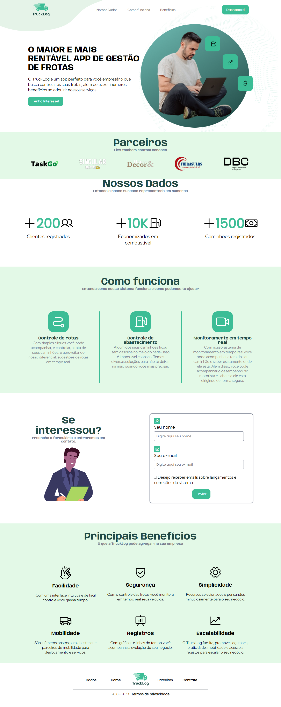
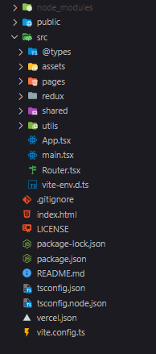
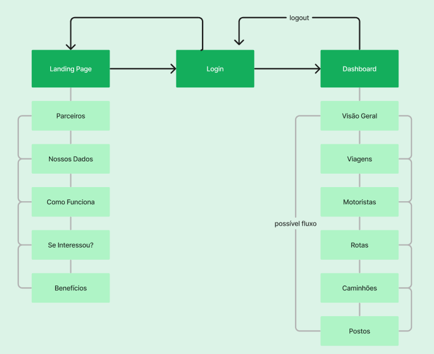

<h1 align="center">TruckLog App</h1>

O TruckLog é uma aplicação web desenvolvida para gerenciar frotas de caminhões. 

  <a href="#-tecnologias">Tecnologias</a>&nbsp;&nbsp;&nbsp;|&nbsp;&nbsp;&nbsp;
  <a href="#-projeto">Projeto</a>&nbsp;&nbsp;&nbsp; |&nbsp;&nbsp;&nbsp;
  <a href="#instalação-e-deploy">Instalação e Deploy </a> &nbsp;&nbsp;|&nbsp;&nbsp;
  <a href="#-licença">Licença</a> 

  

  <a href="https://truck-log.vercel.app" target="_blank">😁 -> Acesse o deploy do projeto!</a>

 

## 🚀 Tecnologias

Esse projeto foi desenvolvido com as seguintes tecnologias:

- React
- TypeScript
- Vitest
- Yup
- Styled Components
- React Router Dom
- React Hook Form
- React Tostify
- React Modal
- React Input Mask

- Redux Toolkit
- RTK Querry API
- Phosphor Icons - CDN
- Chart-JS

## Arquitetura do projeto

  

- Shared

  Pasta onde se encontra os arquivos que são compartilhados por toda a aplicação.

- utils

  Pasta onde se encontra as interfaces utilziadas pelo código e o link da api.

- Redux

  Pasta onde estão localizados todos os arquivos relacionados a redux, como: Slices de cada página, Store e o Root reducer.

- Pages

  Pasta onde estão localizadas as páginas que o usuário acessa:

  Homepage, Login, Dashboard e páginas com informações específicas sobre Viagens, Motoristas, Rotas, Postos e Caminhões.

- @Types

  Local onde estão definidas configurações sobre a api e o styled-components

## Fluxo da Aplicação

  

 Quando um usuário acessa a aplicação, ele é direcionado para a página de login. Após fazer login, o usuário pode acessar as diferentes funcionalidades da aplicação, como visualizar os caminhões, rotas, motoristas, viagens e postos da frota, adicionar novos dados, editar ou excluir entidades  existentes na aplicação.

## 💻 Projeto

O objetivo desta task era desenvolvermos um sistema de controle de rotas e abastecimento com gestão de frotas, utilizando as ferramentas Redux, Redux Toolkit e RTK Query API baseado em um tema de uma empresa cliente da DBC.

> Nosso tema foi: Desenvolver um Sistema de controle de rotas e abastecimento com gestão de frotas.

- Board

  - [Trello](https://trello.com/b/DVIOkXBg/trucklog)

- Análise de projeto
  - [Figma](https://www.figma.com/file/YGQvR5HTlvNNmJT5Yb3QcP/Trucklog---Brainstorming?node-id=0-1&t=JuvPwv6e3YzH74GF-0)

## Instalação e Deploy

Importante❗

Para que você possa executar nossa aplicação não esqueça de habilitar conteúdo não seguro específico para o nosso site, pois a API que utilizamos utiliza uma URL HTTP e não HTTPS, uma vez que o site em si, possui verificação SSL via deploy da vercel, é necessário ativar o conteúdo não seguro específico para o Trucklog para obter dados das requisições.

Para mais informações de como fazer isso: 
-> <a href="https://support.google.com/chrome/answer/114662?hl=pt-BR&co=GENIE.Platform%3DDesktop" target="_blank">Tutorial Chrome</a>

Para mais informações de instalação do projeto:
->  <a href="https://github.com/cristijung/TruckLog/blob/main/README_INSTALL.md" target="_blank">Tutorial Instalação do projeto completo</a>

## 🔘 Licença

Esse projeto está sob a licença MIT.

---

Made with 💚 by [Guilherme](https://github.com/Viilih), [Leonardo](https://github.com/leovscn), [Luan](https://github.com/limaluan), [Rafael](https://github.com/RafaelR4mos), [Vinicius](https://github.com/viniciusbq), [Miguel](https://github.com/MiguelZK), [Henrique](https://github.com/miranda-henrique), [Kellvin](https://github.com/KellvinCorreia), [Marcklen](https://github.com/Marcklen), [Lucas](https://github.com/lluuccaass88/), [Mariana](https://github.com/marimaccos) e [Cris](https://github.com/cristijung)
